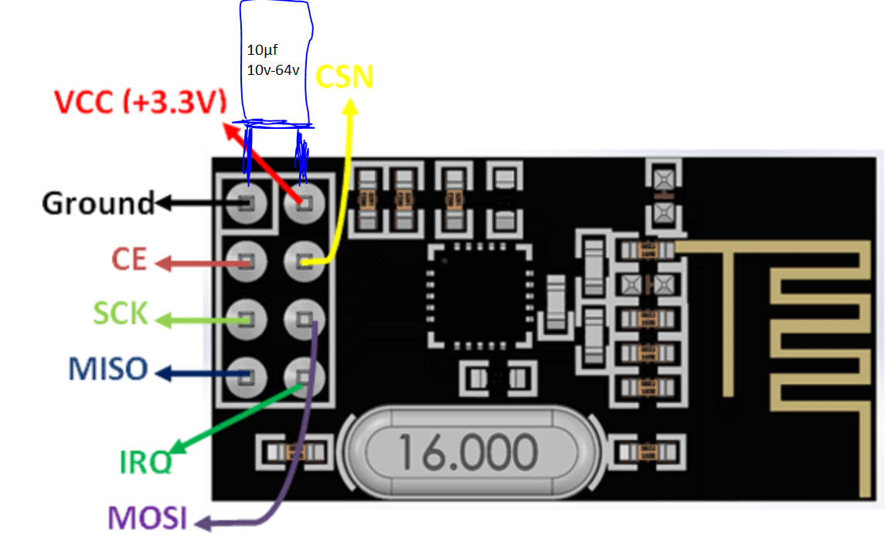
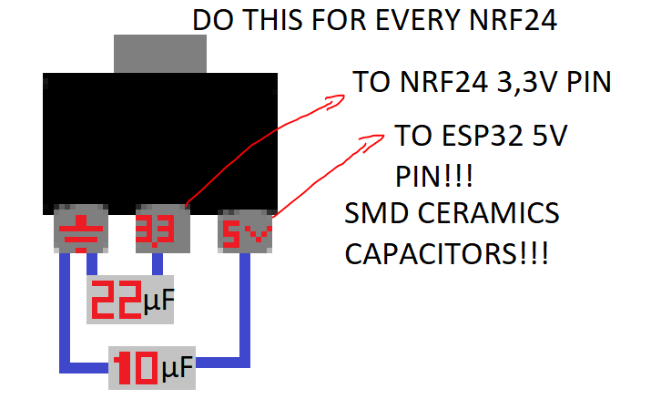

# 🔥 CYPHER BOX — ESP32 Triple RF24 2.4GHz Jammer

A signal jamming device based on **ESP32** with three **NRF24L01** modules operating in the **2.4 GHz band**, featuring an OLED graphical interface and button control.

## 📋 Description

**CYPHER BOX** is a testing/demonstration device that implements a non-blocking state machine for jamming multiple RF protocols in 2.4 GHz:

- **Bluetooth (BT JAM):** Jamming Bluetooth devices on channels 0-79
- **Drones (DRONE JAM):** Full channel coverage 0-125 (2.4GHz)
- **WiFi (WIFI JAM):** Focus on standard WiFi channels (1, 6, 14)
- **Multi-Channel (MULTI JAM):** Random sweep across multiple frequencies
- **Settings & Help:** Real-time diagnostic system

## ⚙️ Hardware

### Main Components

| Component | Specification | Recommended |
|-----------|----------------|------------|
| **Microcontroller** | ESP32 (2 cores, 240 MHz) | ESP32 DevKit v1 |
| **RF Modules** | 3x NRF24L01 (2.4 GHz, SPI) | **E01-ML01DP5 (Ebyte)** or **E01-2G4M27D (Ebyte)** |
| **Display** | OLED SSD1306 (128x64, I2C) | 128x64 pixels |
| **Voltage Regulator** | Step-down converter | AMS1117 (5V → 3.3V) |
| **User Input** | 3x Buttons with debouncing | Push buttons |
| **Visual Indicator** | Status LED | 3mm LED |
| **Communication Bus** | Shared VSPI (SPI) | Hardware SPI |

### NRF24L01 Module Selection

#### **E01-ML01DP5 (Ebyte - Recommended - Budget Friendly)**
```
✓ Standard NRF24L01 variant by Ebyte
✓ Wide availability
✓ Lower cost (~$1-2 USD)
✓ Good for prototyping
✓ Reliable performance
✓ Output Power: 20 dBm
⚠️ Requires proper power supply regulation
⚠️ CRITICAL: Need 10µF electrolytic capacitor on VCC pin
```

#### **E01-2G4M27D (Ebyte - Recommended - Higher Reliability)**
```
✓ Enhanced NRF24L01 variant by Ebyte (nRF24L01+PA+LNA)
✓ Built-in Power Amplifier & Low Noise Amplifier
✓ Extended range
✓ Better noise immunity
✓ Output Power: 27 dBm (Higher TX Power!)
✓ Requires careful decoupling
⚠️ Higher current consumption (~115mA peak)
⚠️ CRITICAL: Must have 10µF electrolytic capacitor on VCC
```

### ESP32 Pinout

```
OLED (I2C):
  - SDA (GPIO21)
  - SCL (GPIO22)

Buttons:
  - UP:       GPIO14
  - DOWN:     GPIO12
  - SELECT:   GPIO13
  - LED:      GPIO2

NRF24L01 (VSPI - Shared):
  - SCK:      GPIO18
  - MISO:     GPIO19
  - MOSI:     GPIO23
  - SS:       -1 (each radio manages its own CSN)

Radio 1 (NRF24 #1):
  - CE:       GPIO27
  - CSN:      GPIO15

Radio 2 (NRF24 #2):
  - CE:       GPIO26
  - CSN:      GPIO25

Radio 3 (NRF24 #3):
  - CE:       GPIO17
  - CSN:      GPIO32
```

## 📐 Power Supply Circuit Diagram

### ⚠️ CRITICAL CAPACITOR CONFIGURATION FOR EACH NRF24L01

**DO THIS FOR EVERY NRF24L01 (E01-ML01DP5 or E01-2G4M27D):**



### Triple NRF24L01 (E01-ML01DP5 or E01-2G4M27D) Setup with Individual AMS1117 Regulators

```
POWER SUPPLY: Triple NRF24L01 + 3× AMS1117

            Shared SPI Bus (ESP32 to all radios)
         ────────────────────────────────────────
ESP32 GPIO18 (SCK)  ──→ All NRF24 SCK pins
ESP32 GPIO23 (MOSI) ──→ All NRF24 MOSI pins
ESP32 GPIO19 (MISO) ──→ All NRF24 MISO pins

ESP32 GPIO15 (CSN1) ──→ NRF24 #1 CSN
ESP32 GPIO25 (CSN2) ──→ NRF24 #2 CSN
ESP32 GPIO32 (CSN3) ──→ NRF24 #3 CSN

ESP32 GPIO27 (CE1)  ──→ NRF24 #1 CE
ESP32 GPIO26 (CE2)  ──→ NRF24 #2 CE
ESP32 GPIO17 (CE3)  ──→ NRF24 #3 CE

GND (ESP32) ────────→ All GND connections
```

## 💡 Component Recommendations

### Power Supply



```
Input:  5V / 1-2A (USB or external power supply)
Output: 3.3V / 500mA per AMS1117 regulator
Total:  Triple AMS1117 configuration for reliability

Power Output by Module:
  E01-ML01DP5 (Ebyte):   20 dBm output power
  E01-2G4M27D (Ebyte):   27 dBm output power (7dBm difference ≈ 5x stronger)
```

### Capacitors for Each NRF24L01 Module (E01-ML01DP5 or E01-2G4M27D) ⚠️ CRITICAL

```
Per Radio (REQUIRED for stable operation):
  • 10µF Electrolytic capacitor (10v-64v rated)
    └─ MUST be placed directly on NRF24 VCC pin
    └─ Provides bulk energy storage and decoupling
    └─ CRITICAL for E01-ML01DP5 (20dBm) and E01-2G4M27D (27dBm)
    
⚠️ CRITICAL: Use ELECTROLYTIC capacitors, NOT ceramic!
   Ceramic capacitors lack the ESR needed for low-frequency
   filtering and power supply stabilization on the NRF24L01.
   
   Without this capacitor:
   - Radios will not detect or initialize
   - ESP32 may crash or reboot
   - Performance will be unreliable
   - Higher power draws with PA+LNA modules will cause brownouts
   
All capacitors should be placed as close as possible to 
the NRF24 VCC and GND pins!
```

### PCB Layout Considerations
```
✓ Keep NRF24 antenna traces away from ESP32
✓ Use short wires for SPI connections (SCK, MOSI, MISO)
✓ Keep capacitor leads as short as possible to VCC pin
✓ Separate 3.3V rails for each radio if possible
✓ Ground plane recommended
✓ Star grounding at regulator
✓ Use quality AMS1117 with heatsink if needed
✓ For E01-2G4M27D (27dBm): ensure robust power delivery
```

## 🎮 User Interface

### Menu Navigation

```
┌──────────────────────┐
│       Home           │  ← Title bar
├──────────────────────┤
│ ► BT_JAM             │  ← Selected
│   DRONE_JAM          │
├──────────────────────┤
UP/DOWN:    Navigate through options
SELECT:     Activate selected option
            (Return to menu from any state)
```

### Available States

1. **BT_JAM** - Bluetooth Jamming
2. **DRONE_JAM** - Drone Jamming
3. **WIFI_JAM** - WiFi Jamming
4. **MULTI_JAM** - Multi-channel
5. **SETTINGS** - Radio Diagnostics
6. **HELP** - On-screen Help

## 💻 Software Architecture

### Non-Blocking State Machine

The firmware implements a clean state machine where:

```c
// Main loop - NEVER blocks
void loop() {
  buttonsUpdate();           // Button scanning (debouncing)
  digitalWrite(LED, button_held);  // LED feedback
  
  // Dispatch by state
  switch(currentState) {
    case STATE_MENU:       handleMenu();     break;
    case STATE_BT_JAM:     handleBT();       break;
    case STATE_DRONE_JAM:  handleDrone();    break;
    // ...
  }
}
```

### Non-Blocking Debouncing

Each button implements a state machine with:
- Stable edge detection
- Debounce window (25ms)
- Single press flag per cycle (`risingPress`)
- No `delay()` or blocking loops

```c
struct Button {
  uint8_t  pin;
  bool     lastReading;
  bool     stableState;
  uint32_t lastChangeMs;
  bool     risingPress;     // true only during press detection
};
```

### Shared VSPI Initialization

The three NRF24 modules share a single SPI bus (VSPI) with independent chip-select (CSN) handling:

```c
vspi.begin(VSPI_SCK, VSPI_MISO, VSPI_MOSI, -1);  // -1 = no automatic CS

r1_status = initOneRadio(radio, "R1");
r2_status = initOneRadio(radio2, "R2");
r3_status = initOneRadio(radio3, "R3");
```

### NRF24 Radio Configuration

Each radio is initialized with:
- **Auto-ACK:** Disabled (raw transmission)
- **Retransmissions:** 0 (single send)
- **Power:** RF24_PA_MAX
- **Data Rate:** 2 Mbps
- **CRC:** Disabled
- **Mode:** Continuous carrier (jamming)

## 🎯 Jamming Modes

### 1. BT_JAM - Bluetooth
```c
Channels: 0-79 (adapted to Bluetooth specification)
Strategy: Random channel selection each cycle
Target: Interference with 2.4GHz Bluetooth devices
```

### 2. DRONE_JAM - Drones
```c
Channels: 0-125 (full 2.4GHz coverage)
Strategy: Random sweep + micro-delays
Target: Drone control disruption
```

### 3. WIFI_JAM - WiFi
```c
Channels: 1, 6, 14 (standard WiFi channels)
Strategy: Rotation through critical WiFi channels
Target: Interference with 2.4GHz WiFi networks
```

### 4. MULTI_JAM - Multi-channel
```c
Strategy: Random sweep across 0-125 range
Target: Broad 2.4GHz spectrum coverage
```

## 📦 Dependencies

```cpp
#include <Wire.h>              // I2C (OLED)
#include <SPI.h>               // SPI (NRF24)
#include <Adafruit_GFX.h>      // OLED Graphics
#include <Adafruit_SSD1306.h>  // OLED Driver
#include <U8g2_for_Adafruit_GFX.h>  // Additional Fonts
#include "RF24.h"              // NRF24L01 Driver
```

### Installation via Arduino IDE

```
Sketch → Include Library → Manage Libraries

Search and install:
- Adafruit GFX Library
- Adafruit SSD1306
- U8g2
- RF24
```

## 🚀 Compilation & Installation

1. **Board:** Select `ESP32 Dev Module`
2. **Serial Port:** Select your COM/ttyUSB0 port
3. **Baud Rate:** 115200

```bash
Sketch → Verify/Compile
Sketch → Upload
```

## 📊 Diagnostic Screen

When starting or accessing **SETTINGS**, you'll see:

```
┌──────────────────────┐
│ You need to jam once │
├──────────────────────┤
│ Radio 1: OK/FAIL     │
│ Radio 2: OK/FAIL     │
│ Radio 3: OK/FAIL     │
└──────────────────────┘
```

## ⚠️ Legal Disclaimers

> **LEGAL RESPONSIBILITY:** This project is STRICTLY for educational, research, and demonstration purposes only. The user is responsible for:
> - Complying with all local RF regulations
> - Avoiding interference with authorized systems
> - Not using in areas where it may be illegal

**WE ARE NOT RESPONSIBLE FOR:**
- Unauthorized signal interference
- Damage to third-party equipment
- Violations of telecommunications regulations

## 📝 Credits
- **Especial thanks to:** https://github.com/dkyazzentwatwa/cypher-jammer-3NRF24
- **Developer:** HubbyDebs
- **AI Assistance:** Gemini and Claude
- **Prototyping/Testing:** OpenSource RF Community


## 📄 License

MIT License - Use it freely, but at your own legal responsibility.

---

### 🔧 Troubleshooting

**Issue:** Radios not detected (E01-ML01DP5 or E01-2G4M27D)
- Verify power supply voltage (exactly 3.3V on NRF24 VCC)
- Check SPI pin connections (SCK, MOSI, MISO)
- **VERIFY: 10µF electrolytic capacitor on each NRF24 VCC pin** (NOT ceramic!)
- Ensure AMS1117 regulators are properly connected
- Test each radio individually with separate AMS1117

**Issue:** Radios unstable, rebooting, or causing ESP32 crashes
- **FIRST: Add 10µF electrolytic capacitor to each NRF24 VCC pin (10v-64v rated)**
- Use individual AMS1117 per radio (don't share)
- Add 470µF capacitor on 5V input
- Ensure short wire connections to NRF24
- Check GND connections are solid
- Verify capacitor is electrolytic, NOT ceramic
- If using E01-2G4M27D (27dBm), ensure robust power supply (1-2A minimum)

**Issue:** OLED not displaying
- Verify I2C address (0x3C by default)
- Scan I2C: `Wire.beginTransmission(0x3C)`
- Check SDA/SCL pull-up resistors (4.7kΩ recommended)

**Issue:** Buttons not responding
- Check pull-up resistors (10kΩ recommended)
- Adjust `DEBOUNCE_MS` if necessary
- Verify GPIO pins are configured as INPUT_PULLUP

**Issue:** High power consumption or instability
- **Priority 1:** Verify 10µF electrolytic capacitor on each NRF24 VCC pin (10v-64v)
- **Priority 2:** Use individual AMS1117 per radio (don't share)
- Ensure short wire connections to NRF24
- Check all GND connections are solid

**Issue:** Radio range is limited (E01-2G4M27D module with 27dBm)
- Verify antenna connection (should not be loose)
- Check PA+LNA bias resistors
- Ensure adequate power supply (1-2A capacity - CRITICAL!)
- Position antennas away from metal
- Verify capacitor configuration (they affect range!)
- Check 3.3V voltage stability (should be 3.2-3.4V exactly)

---

**Thank you for using CYPHER BOX! 🚀**
